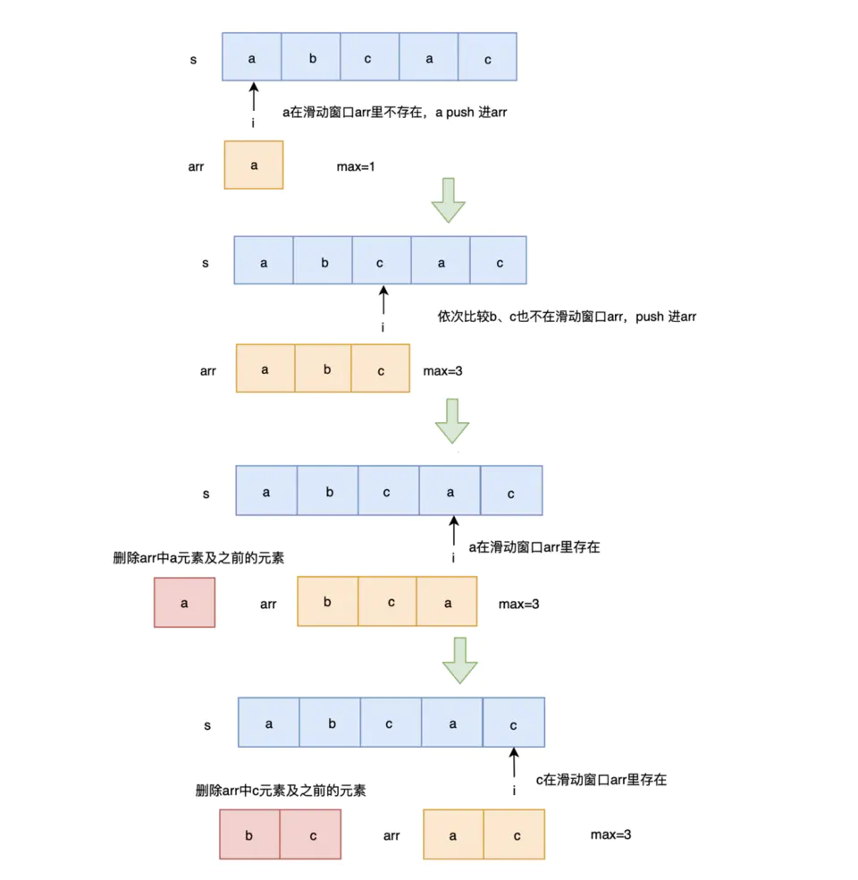
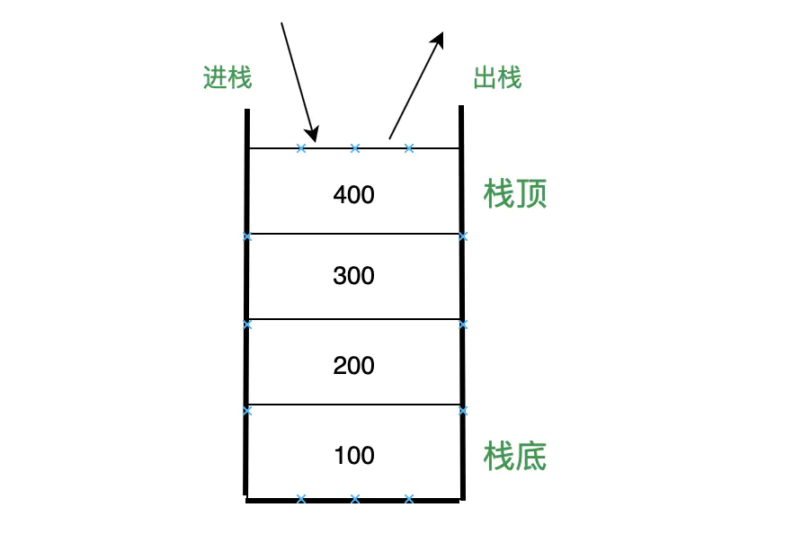
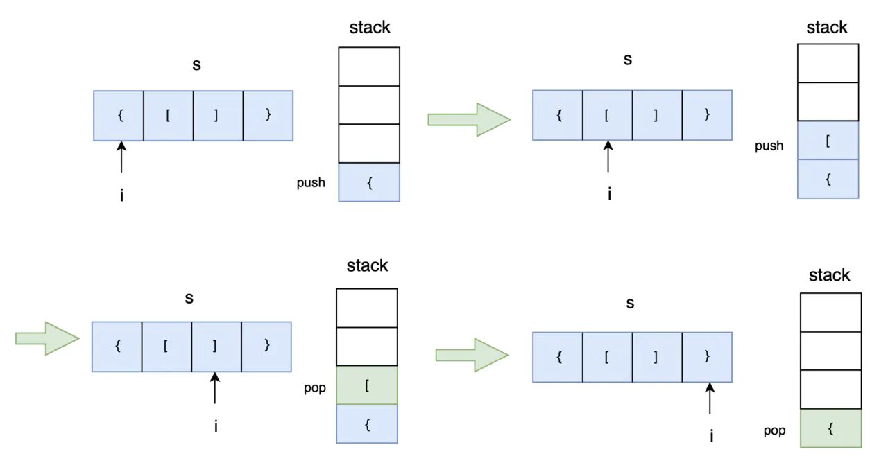
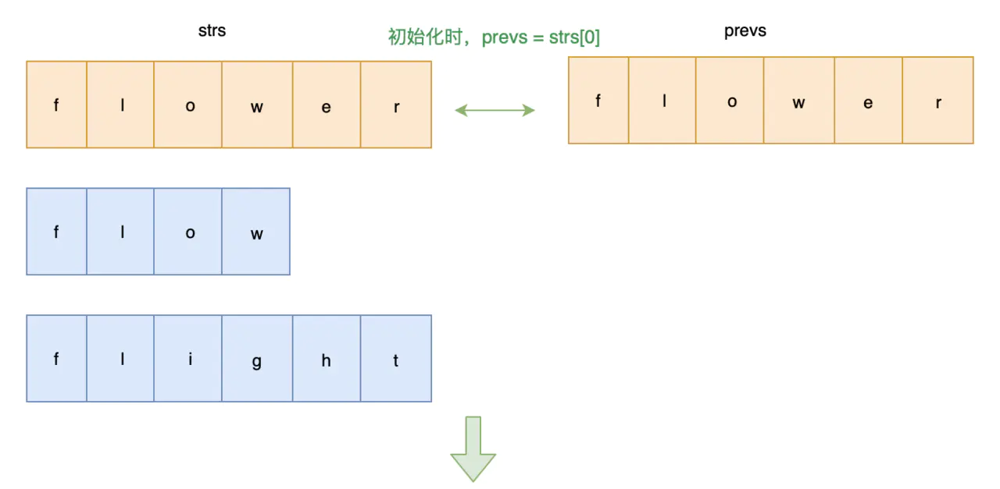
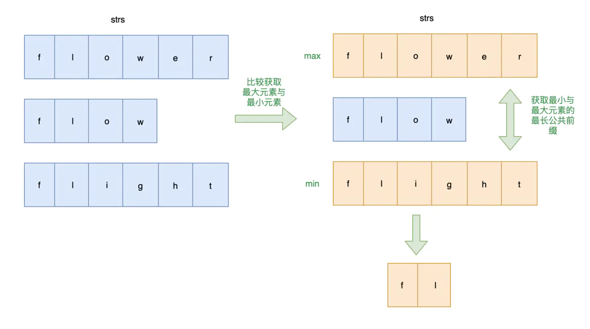
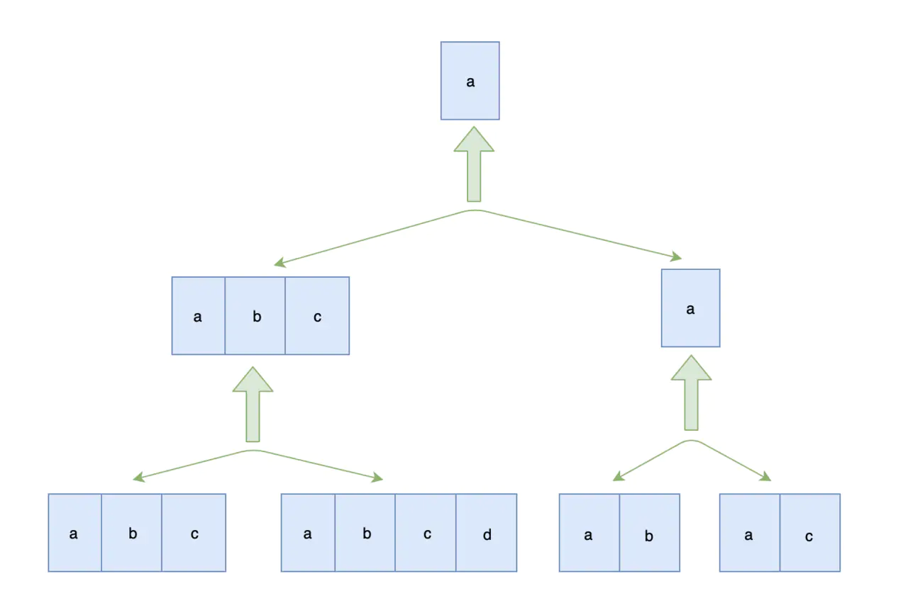
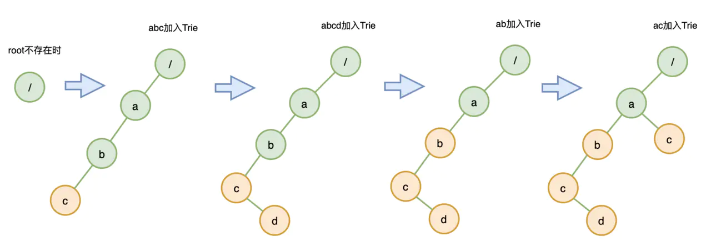

# 常见算法题及完美题解

-----

**引言**

大厂面试越来越难，对算法的要求也越来越多，当面试官问到一个算法题，给出一份完美答案能大大提高面试官的好感度，本系列就是致力于打造一套适用于前端的算法。

## 一、百度：实现一个函数，判断输入是不是回文字符串

### 1. 解法一：使用API

```js
function isPlalindrome(input) {
  if (typeof input !== 'string') return false;
  return input.split('').reverse().join('') === input;
}
```

### 2. 解法二：不使用API

```js
function isPlalindrome(input) {
  if (typeof input !== 'string') return false;
  let i = 0, j = input.length - 1
  while(i < j) {
      if(input.charAt(i) !== input.charAt(j)) return false
      i ++
      j --
  }
  return true
}
```

## 二、字节&Leetcode3：无重复字符的最长子串

### 1. 题目

给定一个字符串，请你找出其中不含有重复字符的 **最长子串** 的长度。

**示例 1:**

```
输入: "abcabcbb"
输出: 3 
解释: 因为无重复字符的最长子串是 "abc"，所以其长度为 3。
```

**示例 2:**

```
输入: "bbbbb"
输出: 1
解释: 因为无重复字符的最长子串是 "b"，所以其长度为 1。
```

**示例 3:**

```
输入: "pwwkew"
输出: 3
解释: 因为无重复字符的最长子串是 "wke"，所以其长度为 3。
     请注意，你的答案必须是 子串 的长度，"pwke" 是一个子序列，不是子串。
```

### 2. 解法

#### 解法一：维护数组

**解题思路**： 使用一个数组来维护滑动窗口

遍历字符串，判断字符是否在滑动窗口数组里
* 不在则 `push` 进数组
* 在则删除滑动窗口数组里相同字符及相同字符前的字符，然后将当前字符 `push` 进数组
* 然后将 `max` 更新为当前最长子串的长度

遍历完，返回 `max` 即可

**画图帮助理解一下：**



**代码实现：**

```js
var lengthOfLongestSubstring = function(s) {
    let arr = [], max = 0
    for(let i = 0; i < s.length; i++) {
        let index = arr.indexOf(s[i])
        if(index !== -1) {
            arr.splice(0, index+1);
        }
        arr.push(s.charAt(i))
        max = Math.max(arr.length, max) 
    }
    return max
};
```

**时间复杂度：O(n2)， 其中 `arr.indexOf()` 时间复杂度为 O(n) ，`arr.splice(0, index+1)` 的时间复杂度也为 O(n)**

**空间复杂度：O(n)**

#### 解法二：维护下标

**解题思路**： 使用下标来维护滑动窗口

**代码实现**：

```js
var lengthOfLongestSubstring = function(s) {
    let index = 0, max = 0
    for(let i = 0, j = 0; j < s.length; j++) {
        index = s.substring(i, j).indexOf(s[j]) 
        if(index !== -1) { 
            i = i + index + 1 
        } 
        max = Math.max(max, j - i + 1) 
    }
    return max
};
```

**时间复杂度：O(n2)**

**空间复杂度：O(n)**

#### 解法三：优化的Map

**解题思路：**

使用 `map` 来存储当前已经遍历过的字符，`key` 为字符，`value` 为下标

使用 `i` 来标记无重复子串开始下标，`j` 为当前遍历字符下标

遍历字符串，判断当前字符是否已经在 `map` 中存在，存在则更新无重复子串开始下标 `i` 为相同字符的下一位置，此时从 `i` 到 `j` 为最新的无重复子串，更新 `max` ，将当前字符与下标放入 `map` 中

最后，返回 `max` 即可

**代码实现**：

```js
var lengthOfLongestSubstring = function(s) {
    let map = new Map(), max = 0
    for(let i = 0, j = 0; j < s.length; j++) {
        if(map.has(s[j])) {
            i = Math.max(map.get(s[j]) + 1, i)
        }
        max = Math.max(max, j - i + 1)
        map.set(s[j], j)
    }
    return max
};
```

**时间复杂度：O(n)**

**空间复杂度：O(n)**

## 三、文章：全方位解读栈结构

### 1. 数据结构栈
   
栈是一种遵从后进先出 (LIFO / Last In First Out) 原则的有序集合，它的结构类似如下：



**代码实现**

```js
function Stack() {
  let items = []
  this.push = function(e) { 
    items.push(e) 
  }
  this.pop = function() { 
    return items.pop() 
  }
  this.isEmpty = function() { 
    return items.length === 0 
  }
  this.size = function() { 
    return items.length 
  }
  this.clear = function() { 
    items = [] 
  }
}
```

**查找：从栈头开始查找，时间复杂度为 O(n)**

**插入或删除：进栈与出栈的时间复杂度为 O(1)**

### 2. 面试：调用栈

> 调用栈是 JavaScript 用来管理函数执行上下文的一种数据结构，它记录了当前函数执行的位置，哪个函数正在被执行。 如果我们执行一个函数，就会为函数创建执行上下文并放入栈顶。 如果我们从函数返回，就将它的执行上下文从栈顶弹出。 也可以说调用栈是用来管理这种执行上下文的栈，或称执行上下文栈（执行栈）。

### 3. 面试：栈空间与堆空间

JavaScript 中的内存空间主要分为三种类型：

* 代码空间：主要用来存放可执行代码
* 栈空间：调用栈的存储空间就是栈空间。
* 堆空间

代码空间主要用来存放可执行代码的。栈空间及堆空间主要用来存放数据的。接下来我们主要介绍栈空间及堆空间。

当调用栈中执行完成一个执行上下文时，需要进行垃圾回收该上下文以及相关数据空间，存放在栈空间上的数据通过 ESP 指针来回收，存放在堆空间的数据通过副垃圾回收器（新生代）与主垃圾回收器（老生代）来回收。

## 四、字节&leetcode155：最小栈（包含getMin函数的栈）

### 1. 题目

设计一个支持 `push` ，`pop` ，`top` 操作，并能在常数时间内检索到最小元素的栈。

* `push(x)` —— 将元素 x 推入栈中。
* `pop()` —— 删除栈顶的元素。
* `top()` —— 获取栈顶元素。
* `getMin()` —— 检索栈中的最小元素。

**示例**:

```js
MinStack minStack = new MinStack();
minStack.push(-2);
minStack.push(0);
minStack.push(-3);
minStack.getMin();   --> 返回 -3.
minStack.pop();
minStack.top();      --> 返回 0.
minStack.getMin();   --> 返回 -2.
```

### 2. 解法

在常数时间内检索到最小元素的栈，即仅需保证 `getMin` 的时间复杂度为 O(1) 即可

```js
var MinStack = function() {
    this.items = []
    this.min = null
};

// 进栈
MinStack.prototype.push = function(x) {
    if(!this.items.length) this.min = x 
    this.min = Math.min(x, this.min)
    this.items.push(x) 
};

// 出栈
MinStack.prototype.pop = function() {
    let num = this.items.pop() 
    this.min = Math.min(...this.items)
    return num
};

// 获取栈顶元素
MinStack.prototype.top = function() {
    if(!this.items.length) return null
    return this.items[this.items.length -1] 
};

// 检索栈中的最小元素
MinStack.prototype.getMin = function() {
    return this.min
};
```

**时间复杂度：进栈O(1)，出栈O(n)，获取栈顶元素O(1)，获取最小元素O(1)**

**空间复杂度：O(n)**

## 五、图解腾讯&leetcode20：有效的括号

### 1. 题目

给定一个只包括 `'('` ，`')'` ，`'{'` ，`'}'` ，`'['` ，`']'` 的字符串，判断字符串是否有效。

有效字符串需满足：

* 左括号必须用相同类型的右括号闭合。
* 左括号必须以正确的顺序闭合。

注意空字符串可被认为是有效字符串。

**示例 1:**

```
输入: "()"
输出: true
```

**示例 2:**

```
输入: "()[]{}"
输出: true
```

**示例 3:**

```
输入: "(]"
输出: false
```

**示例 4:**

```
输入: "([)]"
输出: false
```

**示例 5:**

```
输入: "{[]}"
输出: true
```

### 2. 解法：利用栈结构

**解题思路：** 将字符串中的字符依次入栈，遍历字符依次判断：

* 首先判断该元素是否是 `{` 、 `(` 、 `[ `，直接入栈
* 否则该字符为 `}` 、 `)` 、 `]` 中的一种，如果该字符串有效，则该元素应该与栈顶匹配，例如栈中元素有 `({`， 如果继续遍历到的元素为 `)`, 那么当前元素序列为 `({)` 是不可能有效的，所以此时与栈顶元素匹配失败，则直接返回 `false` ，字符串无效

当遍历完成时，所有已匹配的字符都已匹配出栈，如果此时栈为空，则字符串有效，如果栈不为空，说明字符串中还有未匹配的字符，字符串无效

**画图帮助理解一下：**



**代码实现：**

```js
var isValid = function(s) {
    let map = {
        '{': '}',
        '(': ')',
        '[': ']'
    }
    let stack = []
    for(let i = 0; i < s.length ; i++) {
        if(map[s[i]]) {
            stack.push(s[i])
        } else if(s[i] !== map[stack.pop()]){
            return false
        }
    }
    return stack.length === 0
};
```

**时间复杂度：O(n)**

**空间复杂度：O(n)**

## 六、leetcode1047：删除字符串中的所有相邻重复项

### 1. 题目

给出由小写字母组成的字符串 `S` ，**重复项删除操作** 会选择两个相邻且相同的字母，并删除它们。

在 S 上反复执行重复项删除操作，直到无法继续删除。

在完成所有重复项删除操作后返回最终的字符串。答案保证唯一。

**示例：**

```
输入："abbaca"
输出："ca"
解释：
例如，在 "abbaca" 中，我们可以删除 "bb" 由于两字母相邻且相同，这是此时唯一可以执行删除操作的重复项。之后我们得到字符串 "aaca"，其中又只有 "aa" 可以执行重复项删除操作，所以最后的字符串为 "ca"。
```

**提示：**

1. <= S.length <= 20000
2. S 仅由小写英文字母组成。

### 2. 解法：利用栈

**解题思路：** 遍历字符串，依次入栈，入栈时判断与栈头元素是否一致，如果一致，即这两个元素相同相邻，则需要将栈头元素出栈，并且当前元素也无需入栈

**解题步骤：** 遍历字符串，取出栈头字符，判断当前字符与栈头字符是否一致

* 不一致，栈头字符进栈，当前字符进栈
* 一致，即栈头字符与当前字符相同相邻，都不需要进栈，直接进入下次遍历即可

遍历完成后，返回栈中字符串

**代码实现：**

```js
var removeDuplicates = function(S) {
    let stack = []
    for(c of S) {
        let prev = stack.pop()
        if(prev !== c) {
            stack.push(prev)
            stack.push(c)
        }
    }
    return stack.join('')
};
```

**时间复杂度：O(n)**

**空间复杂度：O(n)**

## 七、字节：查找字符串数组中的最长公共前缀

### 1. 题目

编写一个函数来查找字符串数组中的最长公共前缀。

如果不存在公共前缀，返回空字符串 `""`。

**示例 1:**

```js
输入: ["flower","flow","flight"]
输出: "fl"
```

**示例 2:**

```js
输入: ["dog","racecar","car"]
输出: ""
解释: 输入不存在公共前缀。
```

**说明:**

所有输入只包含小写字母 `a-z` 。

### 2. 解法

#### 解法一：逐个比较

**解题思路**： 从前往后一次比较字符串，获取公共前缀

**画图帮助理解一下：**



**代码实现：**

```js
var longestCommonPrefix = function(strs) {
    if (strs === null || strs.length === 0) return "";
    let prevs = strs[0]
    for(let i = 1; i < strs.length; i++) {
        let j = 0
        for(; j < prevs.length && j < strs[i].length; j++) {
            if(prevs.charAt(j) !== strs[i].charAt(j)) break
        }
        prevs = prevs.substring(0, j)
        if(prevs === "") return ""
    }
    return prevs
};
```

**时间复杂度：O(s)，s 是所有字符串中字符数量的总和**

**空间复杂度：O(1)**

#### 解法二：仅需最大、最小字符串的最长公共前缀

**解题思路**： 获取数组中的最大值及最小值字符串，最小字符串与最大字符串的最长公共前缀也为其他字符串的公共前缀，即为字符串数组的最长公共前缀

> 注意：这里是最大与最小（通过ASCII码判断），与长度没关系，`b` 大于 `a`， `ac` 大于 `ab`，`ac` 大于 `abc`， 可以到在浏览器控制台看一下

例如 `abc` 、 `abcd` 、`ab` 、`ac` ，最小 `ab` 与最大 `ac` 的最长公共前缀一定也是 `abc` 、 `abcd` 的公共前缀

**画图帮助理解一下：**



**代码实现：**

```js
var longestCommonPrefix = function(strs) {
    if (strs === null || strs.length === 0) return "";
    if(strs.length === 1) return strs[0]
    let min = 0, max = 0
    for(let i = 1; i < strs.length; i++) {
        if(strs[min] > strs[i]) min = i
        if(strs[max] < strs[i]) max = i
    }
    for(let j = 0; j < strs[min].length; j++) {
        if(strs[min].charAt(j) !== strs[max].charAt(j)) {
            return strs[min].substring(0, j)
        }
    }
    return strs[min]
};
```

**时间复杂度：O(n+m)，n是数组的长度， m 是字符串数组中最短字符的长度**

**空间复杂度：O(1)**

#### 解法三：分治策略 归并思想

分治，顾名思义，就是分而治之，将一个复杂的问题，分成两个或多个相似的子问题，在把子问题分成更小的子问题，直到更小的子问题可以简单求解，求解子问题，则原问题的解则为子问题解的合并。

这道题就是一个典型的分治策略问题：

* 问题：求多个字符串的最长公共前缀
* 分解成多个相似的子问题：求两个字符串的最长公共前缀
* 子问题可以简单求解：两个字符串的最长公共前缀求解很简单
* 原问题的解为子问题解的合并：多个字符串的最长公共前缀为两两字符串的最长公共前缀的最长公共前缀，我们可以归并比较两最长公共前缀字符串的最长公共前缀，知道最后归并比较成一个，则为字符串数组的最长公共前缀：`LCP(S1, S2, ..., Sn) = LCP(LCP(S1, Sk), LCP(Sk+1, Sn))`

画图帮助理解一下：

以 `abc` 、 `abcd` 、`ab` 、`ac` 为例：



**代码实现：**

```js
var longestCommonPrefix = function(strs) {
    if (strs === null || strs.length === 0) return "";
    return lCPrefixRec(strs)
};

// 若分裂后的两个数组长度不为 1，则继续分裂
// 直到分裂后的数组长度都为 1，
// 然后比较获取最长公共前缀
function lCPrefixRec(arr) {
  let length = arr.length
  if(length === 1) {
    return arr[0]
  }
  let mid = Math.floor(length / 2),
      left = arr.slice(0, mid),
      right = arr.slice(mid, length)
  return lCPrefixTwo(lCPrefixRec(left), lCPrefixRec(right))
}

// 求 str1 与 str2 的最长公共前缀
function lCPrefixTwo(str1, str2) {
    let j = 0
    for(; j < str1.length && j < str2.length; j++) {
        if(str1.charAt(j) !== str2.charAt(j)) {
            break
        }
    }
    return str1.substring(0, j)
}
```

**时间复杂度：O(s)，s 是所有字符串中字符数量的总和**

**空间复杂度：O(m*logn)，n是数组的长度，m为字符串数组中最长字符的长度**

#### 解法四：Trie 树（字典树）

Trie 树，也称为字典树或前缀树，顾名思义，它是用来处理字符串匹配问题的数据结构，以及用来解决集合中查找固定前缀字符串的数据结构。

**解题思路：** 构建一个 Trie 树，字符串数组的最长公共序列就为从根节点开始遍历树，直到：

* 遍历节点存在超过一个子节点的节点
* 或遍历节点为一个字符串的结束字符

为止，走过的字符为字符串数组的最长公共前缀

**画图帮助理解一下：**

构建一个 Trie 树，以 `abc` 、 `abcd`  、`ab` 、`ac` 为例：



**代码实现：**

```js
var longestCommonPrefix = function(strs) {
    if (strs === null || strs.length === 0) return "";
    // 初始化 Trie 树
    let trie = new Trie()
    // 构建 Trie 树
    for(let i = 0; i < strs.length; i++) {
        if(!trie.insert(strs[i])) return ""
    }
    // 返回最长公共前缀
    return trie.searchLongestPrefix()
};
// Trie 树
var Trie = function() {
    this.root = new TrieNode()
};
var TrieNode = function() {
    // next 放入当前节点的子节点
    this.next = {};
    // 当前是否是结束节点
    this.isEnd = false;
};
Trie.prototype.insert = function(word) {
    if (!word) return false
    let node = this.root
    for (let i = 0; i < word.length; i++) {
        if (!node.next[word[i]]) {
            node.next[word[i]] = new TrieNode()
        }
        node = node.next[word[i]]
    }
    node.isEnd = true
    return true
};
Trie.prototype.searchLongestPrefix = function() {
    let node = this.root
    let prevs = ''
    while(node.next) {
        let keys = Object.keys(node.next)
        if(keys.length !== 1) break
        if(node.next[keys[0]].isEnd) {
            prevs += keys[0]
            break
        }
        prevs += keys[0]
        node = node.next[keys[0]]
    }
    return prevs
}
```

**时间复杂度：O(s+m)，s 是所有字符串中字符数量的总和，m为字符串数组中最长字符的长度，构建 Trie 树需要 O(s) ，最长公共前缀查询操作的复杂度为 O(m)**

**空间复杂度：O(s)，用于构建 Trie 树**