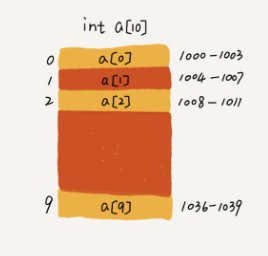

# 数组的常用方法

------------

**数组是一种线性表数据结构。它用一组连续的内存空间，来存储一组具有相同类型的数据。**



上图可以看出，数组的存储方式为连续的内存空间，那么几句可以通过下面的方式，

```js
a[i]_address = base_address + i * data_type_size
```

实现高效的数组随机访问。中间操作就没那么高效了，因为要在中间的位置删除一个元素的话，后面的元素就都要向前移动一位，插入也是同样。下面具体来看一下JS数组。

## 一、创建数组的方式

1. 使用Array构造函数

```js
let colors1 = new Array();
let colors2 = new Array(20);//创建length为20的数组
let colors3 = new Array('red', 'yellow', 'blue'); //以参数中的值来构建数组
```

2. 使用数组字面量表示法

```js
let colors = ["red", "green"];
let values = [1,2,];//强烈不建议这样使用，这位这样可能会创建一个包含2或3项的数组
//在IE8以及更早的版本中，第三个值undefined，其他浏览器只包含1，2的数组
```

在使用数组字面量表示法的时候，不会调用Array构造函数（Firefox 3及更早版本除外）

3. 使用`Array.of`方法将一组值，转为数组。

```js
Array.of(3,11,8) // [3,11,8]
Array.of(3) // [3]
```

## 二、数组的length属性

这个属性不是只读的，可以设置这个属性，从数组的末尾移除或想数组中添加新项。

```js
let colors = ['red','yellow', 'blue'];
colors.length = 2;
console.log(colors[2]) //undefined;

colors = ['red','yellow', 'blue'];
colors.length = 4;
console.log(colors[3]) // undefined;

colors = ['red','yellow', 'blue'];
colors[colors.length] = 'green';//位置3添加一种颜色
colors[colors.length] = 'brown';//位置4添加一种颜色
```

## 三、数组检测

1. 对于一个网页或一个全局全局作用域而言，使用`instanceof`就能搞定。

```JS
value instanceof Array
```

2. 如果网页中包含多个框架，那实际上就存在两个以上不同的全局执行环境，从而存在两个以上不同版本的Array构造函数。如果你从一个框架向另一个框架传入一个数组，那么传入的数组与第二个框架中原生创建的数组分别具有各自不同的构造函数。为了解决这个问题新增了`Array.isArray`方法，该方法目的是确定某个值是不是数组，而不管它到底在哪个全局执行环境中创建的。

```js
Array.isArray(value)

if (!Array.isArray) {
  Array.isArray = function(arg) {
    return Object.prototype.toString.call(arg) === '[object Array]';
  };
}
// 也可以用这个方法检测数组，该方法不能检测非原生构造函数的构造函数名
```

## 四、转换方法

1. `toLocaleString()`、`toString()`、`valueOf()`方法。其中`toString()`方法会返回由数组中每个值的字符串拼接而成的一个以逗号分隔的字符串，而调用`valueOf()`返回的还是数组。

```js
let colors = ['red','yellow', 'blue'];

colors.toString() // red,blue,green
colors.valueOf() //['red','yellow', 'blue']
colors.toLocaleString() //['red','yellow', 'blue']

console.log(colors.toString()) // red,blue,green
alert(colors.valueOf()) // red,blue,green
console.log(colors.toLocaleString()) // red,blue,green
```

alert里面调用`valueOf`返回了字符串是因为alert要接受字符串参数，所以隐式调用了`toString`。`toLocaleString`表示在特定语言环境下的表示字符串，新的 locales 和 options 参数让应用程序可以指定要进行格式转换的语言，并且定制函数的行为，通常返回与`toString`相同的值。

2. `join()`方法可以使用不同的分隔符，来构建这个字符串。

```js
let colors = ['red','yellow', 'blue'];
console.log(colors.join('|')) // "red|yellow|blue"
```

3. `Array.from`方法用于将一个类似数组或可迭代对象创建一个新的，浅拷贝的数组实例。

```js
let arrayLike = {
    '0': 'a',
    '1': 'b',
    '2': 'c',
    length: 3
};

// ES5的写法
var arr1 = [].slice.call(arrayLike); // ['a', 'b', 'c']

// ES6的写法
let arr2 = Array.from(arrayLike); // ['a', 'b', 'c']

Array.from([1, 2, 3])
// [1, 2, 3] 如果参数是一个真数组，会返回一个一摸一样的新数组
```

该方法还接受`第二个参数`，（可选的）返回对数组每一项处理的结果，和（可选的）运行该函数的作用域对象--`影响this的值`

```js
Array.from([1, 2, 3], (x) => x * x)
// [1, 4, 9]
```

## 五、类似栈的方法

1. `push(推入)`：可以接受任意数量的参数，然后**返回修改后的数组的**长度。
2. `pop(弹出)`: 可以从数组的末尾移除最后一项，减少数组的长度，**返回删除的项**。

## 六、类似队列的方法

1. `shift`： 移除数组中的第一项，并**返回该项**，同时使数组长度减1。
2. `unshift`: 在数组前端添加任意个元素，并**返回数组的长度**。 `shift`结合`push`，`unshift`结合`pop`可以像队列一样使用数组。

## 七、重排序方法

1. `reverse`顾名思义，就是反转数组项的顺序，并**返回排序后的数组**；
2. `sort`排序数组的方法，默认情况下，按照升序排列数组项，调用每个数组项的`toString()`方法，然后比较得到的字符串，确定如何排序。也可以接受一个函数。**返排序后的数组**。

```js
[1,5,2,4,3].sort((prev,next)=>{
    if(prev < next){
        return -1 //返回负数，保持原位。
    }else if(prev > next){
        return 1 //返回正数，交换位置。
    }else{
        return 0 //返回负数，保持原位。
    }
})
```

## 八、操作方法

1. `concat()`这个方法会先创建当前数组的一个副本，然后将接受到的参数添加到这个副本的末尾，最后返回数新构建的数组。

```js
let colors1 = ['red','yellow', 'blue'];
let colors2 = colors1.concat('white', ['black', 'green']);
console.log(colors1)//["red", "yellow", "blue"]
console.log(colors2)//["red", "yellow", "blue", "white", "black", "green"]
```

2. `slice()`基于当前数组中的一个或多个项创建一个新数组，接受`一或两个参数`，既要返回的起始和结束位置。不会改变原数组。

```js
let colors1 = ['red','yellow', 'blue'];
let colors2 = colors1.slice(0);
let colors3 = colors1.slice(0, 1);
console.log(colors2)//['red','yellow', 'blue'];
console.log(colors3)//['red'];
console.log(colors1 == colors2) //false
```

3. `splice()`方法

* 删除

```js
let color = ["red","green","blue"];
let removed = color.splice(0,1);
console.log(color); //["green","blue"]
console.log(removed);//["red"]
```

* 插入

```js
removed = color.splice(1,0,"yellow","orange");
console.log(removed);//[]
console.log(color);//["green", "yellow", "orange", "blue"]
```

* 替换

```js
removed = color.splice(1,1,"red","purple");
console.log(removed);//["yellow"]
console.log(color);//["green", "red", "purple", "orange", "blue"]
```

第一个参数起始位置，第二参数删除几个，第三个参数要插入的任意项。`splice`返回的是删除的项组成的数组，没有则返回空。

4. `copyWithin()`方法将指定位置的成员复制到其他位置（会覆盖原有成员）。

```js
// 将3号位复制到0号位
[1, 2, 3, 4, 5].copyWithin(0, 3, 4) // [4, 2, 3, 4, 5]
// -2相当于3号位，-1相当于4号位
[1, 2, 3, 4, 5].copyWithin(0, -2, -1) // [4, 2, 3, 4, 5]
```

接收`三个`参数，第一个是起始替换数据的位置，第二个是从该位置开始读取数据，第三个到该位置前停止读取数据。 

5. `fill()`方法使用给定值，填充一个数组。

```js
['a', 'b', 'c'].fill(7)
// [7, 7, 7]

new Array(3).fill(7)
// [7, 7, 7]
```

还可以接收`第二`和`第三个参数`，用于指定填充的`起始位置`和`结束位置`

```js
['a', 'b', 'c'].fill(7, 1, 2)
// ['a', 7, 'c']
```

## 九、位置方法

`indexOf()`和`lastIndexOf()`都接收两个参数：要查找的项和表示查找起点位置的索引。`indexOf`方法从数组的头部开始查找，`lastIndexOf`方法从数组的尾部开始查找。没找到则返回-1.

```js
let arr = [1,2,3,2];
arr.indexOf(2)// 1
arr.lastIndexOf(2)// 3
arr.indexOf(4)// -1
```

这两个方法内部都是（===）来判断，所以会导致NaN误判。

`findIndex()`方法，返回第一个符合条件的数组成员位置，没找到返回`-1`，两个参数：每一项处理函数和（可选的）运行该函数的作用域对象

```js
[1, 5, 10, 15].findIndex(function(value, index, arr) {//依次当前的值、当前的位置和原数组
  return value > 9;
}) // 2
```

## 十、查值方法

`find()`方法。查找出第一个符合条件的数组成员，接收两个参数：一个遍历每一项的函数和（可选的）运行该函数的作用域对象

```js
[1, 4, -5, 10].find((n) => n < 0) // -5
```

`includes()`返回一个布尔值，接收两个参数：要查找的项和表示查找起点位置的索引

```js
[1, 2, 3].includes(2)     // true
[1, 2, 3].includes(4)     // false
[1, 2, NaN].includes(NaN) // true
[1, 2, 3].includes(3, 3);  // false
[1, 2, 3].includes(3, -1); // true
```

`flat()`用于将嵌套的数组“拉平”，变成以为数组，**返回一个新数组**。接收一个参数，表示想要拉平的层数。

```js
[1, 2, [3, [4, 5]]].flat() // [1, 2, 3, [4, 5]]
[1, 2, [3, [4, 5]]].flat(2) // [1, 2, 3, 4, 5]
[1, [2, [3]]].flat(Infinity) // [1, 2, 3] 不管多少曾，都要转成一维数组，可以 用Infinity参数。
```

## 十一、迭代方法

`every`,`filter`,`forEach`,`map`,`some`,`flatMap`共6个迭代的方法，每个方法都接收两个参数：要在每一项上运动的函数和（可选的）运行该函数的作用域对象--影响this的值。

传入这些方法中的函数会接受3个参数：数组项的值，该项在数据中的位置和数组对象本身。

`every()`:对数组中的每一项运行给定函数，如果该函数对**每一项都返回true，则返回true，否则返回false**。

```js
let number = [1,2,3,4,5];
let everyResult = number.every((item, index, array)=>{
    return item > 2
})
console.log(everyResult)// false
```

`some()`:方法则是只传入的函数对数组中的某一项返回true，就会返回true。

```js
let number = [1,2,3,4,5];
let someResult = number.some((item, index, array)=>{
    return item > 2
})
console.log(someResult)// true
```

`filter()`:方法利用指定的函数确定是否在返回的数组中包含某一项。例如要返回一个所有值都大于2的数组

```js
let number = [1,2,3,4,5];
let filterResult = number.filter((item, index, array)=>{
    return item > 2
})
console.log(filterResult)// [3, 4, 5]
```

`map()`:也返回一个数组，而这个数组的每一项都是在原始数组中的对应项上运行传入函数的结果。

```js
let number = [1,2,3,4,5];
let mapResult = number.map((item, index, array)=>{
    return item * 2
})
console.log(mapResult)// [2, 4, 6, 8, 10]
```

`forEach`:它只是对数组中的每一项运行传入的函数。没有返回值。

`flatMap()`方法对原数组的每个成员执行一个函数，并对返回值执行flat()方法，**返回一个新数组**。

```js
// 相当于 [[2, 4], [3, 6], [4, 8]].flat()
[2, 3, 4].flatMap((x) => [x, x * 2]) // [2, 4, 3, 6, 4, 8]

// 相当于 [[[2]], [[4]], [[6]], [[8]]].flat()
[1, 2, 3, 4].flatMap((x, index, array) => [[x * 2]]) // [[2], [4], [6], [8]]
//默认只能展开一层
```

## 十二、归并方法

`reduce`从数组的第一项开始，逐个遍历到最后，`reduceRight`则从数组的最后一项开始，向前遍历到第一项。

这两个方法都接受两个参数：一个在每一项调用的函数和（可选的）作为归并基础的初始值。

```js
let values = [1,5,4,7];
let sum = values.reduce((prev,cur,index,array)=>{ //这个函数的四个参数：前一个值，当前值，项的索引和数组对象
    return prev+cur; //返回的任何值作为第一个参数自动传给下一项，第一次迭代发生在数组的第二项，因此第一个参数是数组的第一项，第二个参数是数组的第二项
});
console.log(sum);//17
```