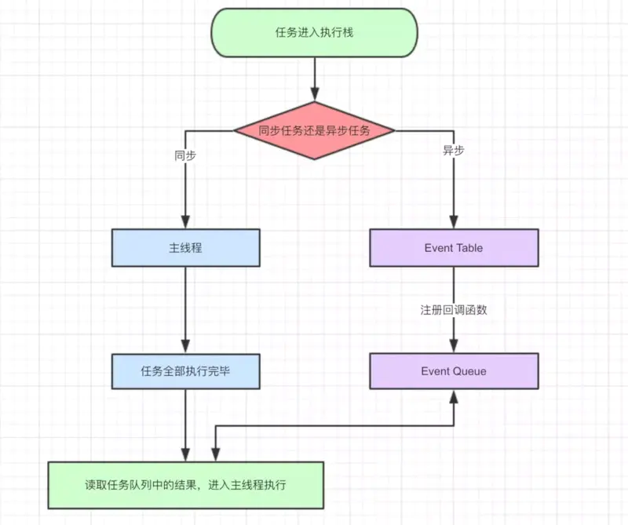

# JS 事件机制 Event Loop

--- 

### 谈谈Event Loop

无论是浏览器的Event loop 还是 Nodejs 中的Event loop，都是基于JS 的单线程设计而生的(纯属个人理解)，通过事件循环实现非阻塞异步执行效果。

### 几个概念

谈到事件机制首先弄清楚`主线程`、`执行栈`、`任务队列`这几个概念。

* **主线程**：运行JS 代码。JS 的单线程针对的是单一的主线程，不是只能有一个线程。

* **执行栈**：关于执行栈的概念结合执行上下文来看，[《JavaScript深入之执行上下文栈》](https://juejin.im/post/6844903473301946381)

* **任务队列Task Queue**：即队列，是一种先进先出的数据结构

三者的关系是：主线程要执行的都在执行栈里，执行栈里的内容是从任务队列里拿过来的。

### 关于任务

任务可以划分为`宏任务`和`微任务`。

* `宏任务MacroTask`： 整个script ， setTimeout, setInterval, setImmidiate(浏览器暂时不支持，只有IE10，但是在nodejs 中常用到)、I/O、UI Redering。

* `微任务（MicroTask）`：Promise, Async/Await(底层就是Promise)、Process.nextTick (node独有)、MutationObserver。

具体执行时，任务还有另一种的划分就是`同步任务`和`异步任务`

* 对于同步任务来说 ，放入执行栈里按序依次执行的，但是对于异步任务而言，是在异步任务有了结果之后将异步任务的回调函数放到任务队列里等待主线程空闲时执行。注意这里是在执行栈中如果遇到异步任务，是注册异步任务的回调函数 ，把回调函数放到任务队列中(`这一步会产出任务`)。

### 浏览器中的Event Loop

---



**事件循环的进程模型**

* 执行栈一开始认为是空，将宏任务: 整体的script 压入栈执行。
* 执行过程中遇到同步任务按序一步一步执行，遇到异步任务注册异步任务的回调函数放到对应的任务队列中（这里有宏任务队列，微任务队列）。这样就产生了新的macro-task 和 micro-task。
* script 中代码执行完，将script 出栈，也是一次宏任务出栈 。
* 检测任务队列中是否有微任务，清理微任务队列。这里需要注意的是宏任务出队是一个一个出，而微任务是一队一队出。
* 更新页面渲染
* 检测是否有web worker 任务，处理web worker。
* 上述过程循环往复，直到两个队列都清空。

总结一下整体的流程：

> 主线程首先会执行一个宏任务，当此宏任务执行完之后，会去查看是否有微任务队列。如果有，那就清空整个微任务队列。如果没有，会去查看宏任务队列，取宏任务队列中的第一个去执行，执行宏任务的过程中遇到微任务，依次加入微任务队列等待下次执行。(`当然执行微任务的时候也会产生宏任务，主线程会放入宏任务队列`)。栈空后，再次读取任务队列中的任务，以此类推。

**举个例子**

```js
 console.log('script start')
 setTimeout(() => {
     console.log('setTimeout 1');
     Promise.resolve().then(() => {
          console.log('promise1')
    })
}, 0)

 new Promise(resolve => {
    console.log('promise2');
    setTimeout(() => {
        console.log('setTimeout2');
        resolve();
    }, 0)
 })

 Promise.resolve().then(() => {
     console.log('promise3');
     setTimeout(() => {
          console.log('setTimeout 3')
    },0)
 }).then(() => console.log('promise4'))
 console.log('script end');
```

**输出结果：**

```js
script start 
promise2
script end
promise3
promise4
setTimeout1
promise1
setTimeout2
setTimeout3
```

详细执行流程如下：

**1. 初始宏任务队列只有整体script，执行栈、微任务队列皆为空**

* 宏任务script入栈执行：
* 输出 `script start`
* 遇见`setTimeout1`放入宏任务队列
* 执行同步代码输出 `promise2`,遇见`setTimeout2`放入宏任务队列
* 遇见微任务`promise3`、`promise4`放入微任务队列
* 输出 `script end`

我们看下第一个宏任务执行完的状态：

**宏任务队列**: `setTimeout1`、`setTimeout2`

**微任务队列**: `promise3`、 `promise4`

**2. 接下来去清理微任务队列**

> 微任务队列遵循先进先出原则，`promise3`入栈执行:输出 `promise3`、,将`setTimeout3`放入宏任务队列。`promise3`出栈 ，`promise4`入栈执行，输出 `promise4`

清理完微任务后的状态：

**宏任务队列**：`setTimeout1`、`setTimeout2`、`setTimeout3`

**微任务队列**：空

**3. 从宏任务队列中取出第一个入栈执行**

> `setTimeout1` 入栈执行，输出 `setTimeout1` ，将 `promise1` 放入微任务队列

本次执行完的状态：

**宏任务队列**： `setTimeout2`、`setTimeout3`

**微任务队列**： `promise1`

**4. 清理微任务队列**

> 输出 promise1

本轮执行完状态：

**宏任务队列**： `setTimeout2`、`setTimeout3`

**微任务队列**： 空

**5. 从宏任务队列中取出第一个执行**

> 输出 setTimeout2

本轮执行完状态：

**宏任务队列**： `setTimeout3`

**微任务队列**： 空

**6. 微任务队列为空，继续从宏任务队列取出第一个执行**

> 输出 `setTimeout3`

至此`宏任务队列`和`微任务队列`都为空。

`从上述执行过程中， 不难看出，浏览器的Event Loop 总是一个宏任务 ——> 一队微任务 这种顺序依次循环`

**另一个例子**

```js
var a = async function () {
    await Promise.resolve().then(() => console.log(111));
    console.log(222)
}
a().then(() => console.log(333))

var b = async function () {
    await setTimeout(() => console.log('aaa'), 0);
    console.log('bbb')
}
b().then(() => console.log('ccc'))

var c = async function () {
    await console.log('A');
    console.log('B')
}
c().then(() => console.log('C'))
```

**输出结果：**

> `A` -> `111` -> `bbb` -> `B` -> `222` -> `ccc` -> `C` -> `333` -> `aaa`

**执行顺序：**

**1. script入栈**

> 执行同步代码，调用a()：将111放入微任务队列。继续往下走执行b()，将aaa 放入宏任务队列，将 bbb 放入微任务队列，接着执行c()， 打印 `A` ， 将 `B` 放入微任务队列。

此次执行完的状态：

> 宏任务队列: `aaa`
> 
> 微任务队列: `111` 、 `bbb`、 `B`

**2. 清理微任务队列：**

> 执行 111, 打印`111` 、将`222`放入微任务队列，执行`bbb`:打印`bbb`并将 `ccc` 放入微任务队列，执行`B`: 打印`B`并将`C`放入微任务队列，此时微任务队列并没有清理完，所以接着打印`222`、`ccc`、`C`，打印完`222`将`333`放置微任务队列，所以接着打印`333`。

此次执行完的状态:

> 宏任务队列: `aaa`
> 
> 微任务队列: 空

**3. 执行aaa， 打印出aaa**

上述代码若是不好理解可以转化为promise的方式来理解，效果如下:

```js
new Promise(resolve => {
   	Promise.resolve()
        .then(() => console.log(111))
        .then(() => { 
	    console.log(222)
	    resolve()
	})
})
.then(() => console.log(333))

new Promise(resolve => {
	setTimeout(() => console.log('aaa'), 0)
	Promise.resolve().then(() => {
            console.log('bbb')
            resolve()
	})
	
})
.then(() => console.log('ccc'))

new Promise(resolve => {
	console.log('A')
	Promise.resolve()
	.then(() => {
	    console.log('B')
	    resolve()
	})
})
.then(() => console.log('C'))
```

但这纯属个人理解，若有问题，还请大神指导。
