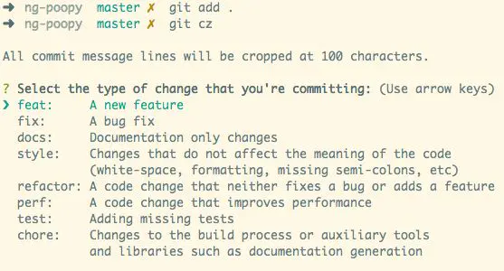
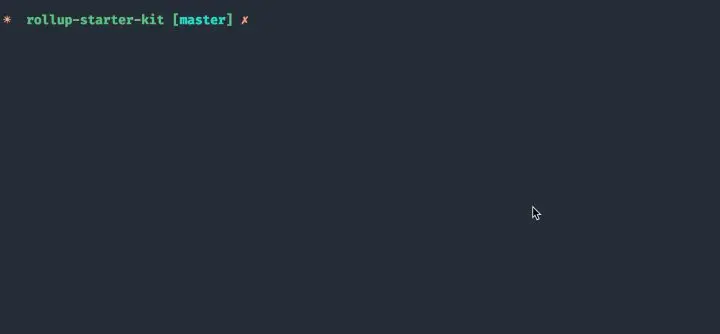

# 优雅的提交你的 Git Commit Message

------

转自：[优雅的提交你的 Git Commit Message](https://juejin.cn/post/6844903606815064077)

> commit message 是开发的日常操作, 写好 log 不仅有助于他人 review, 还可以有效的输出 CHANGELOG, 对项目的管理实际至关重要, 但是实际工作中却常常被大家忽略.
希望通过本文, 能够帮助大家重视和规范 commit message 的书写.

## 起因

知乎上有个问题: [如何写好 Git commit log?](https://www.zhihu.com/question/21209619/answer/257574960) 很有意思, 能看到各种提交风格: 有用 emoji 的, 有用唐诗的, 有用随机生成的. 风格没有对错, 只要能够体现出 commit 所做的修改即可.
但是最让我印象深刻的是 @李华桥 的答案:

> 这种东西，当然要借助工具了，才能够写得即规范，又格式化，还能够支持后续分析。
目前比较建议的是，使用终端工具 [commitizen/cz-cli](https://github.com/commitizen/cz-cli) + [commitizen/cz-conventional-changelog](https://github.com/commitizen/cz-conventional-changelog)  + [conventional-changelog/standard-version](https://github.com/conventional-changelog/standard-version) 一步解决提交信息和版本发布。
甚至，如果想更狠一点，在持续集成里面加入 [marionebl/commitlint](https://github.com/marionebl/commitlint) 检查 commit 信息是否符合规范，也不是不可以。

本文就顺着这个方向, 给大家介绍下如何保障项目 commit message 的规范和格式化.

## Commit Message 格式

目前规范使用较多的是 [Angular 团队的规范](https://github.com/angular/angular.js/blob/master/DEVELOPERS.md%23-git-commit-guidelines), 继而衍生了 [Conventional Commits specification.](https://conventionalcommits.org/) 很多工具也是基于此规范, 它的 message 格式如下:

```html
<type>(<scope>): <subject>
<BLANK LINE>
<body>
<BLANK LINE>
<footer>
```

我们通过 git commit 命令带出的 vim 界面填写的最终结果应该类似如上这个结构, 大致分为三个部分(使用空行分割):

* 标题行: 必填, 描述主要修改类型和内容
* 主题内容: 描述为什么修改, 做了什么样的修改, 以及开发的思路等等
* 页脚注释: 放 Breaking Changes 或 Closed Issues

分别由如下部分构成:

* type: commit 的类型
* feat: 新特性
* fix: 修改问题
* refactor: 代码重构
* docs: 文档修改
* style: 代码格式修改, 注意不是 css 修改
* test: 测试用例修改
* chore: 其他修改, 比如构建流程, 依赖管理.
* scope: commit 影响的范围, 比如: route, component, utils, build...
* subject: commit 的概述, 建议符合  50/72 formatting
* body: commit 具体修改内容, 可以分为多行, 建议符合 50/72 formatting
* footer: 一些备注, 通常是 BREAKING CHANGE 或修复的 bug 的链接.

这样一个符合规范的 commit message, 就好像是一份邮件.

## git commit 模板

如果你只是个人的项目, 或者想尝试一下这样的规范格式, 那么你可以为 git 设置 commit template, 每次 git commit 的时候在 vim 中带出, 时刻提醒自己:

修改 ~/.gitconfig, 添加:

```
[commit]
template = ~/.gitmessage
```

新建 ~/.gitmessage 内容可以如下:

```
# head: <type>(<scope>): <subject>
# - type: feat, fix, docs, style, refactor, test, chore
# - scope: can be empty (eg. if the change is a global or difficult to assign to a single component)
# - subject: start with verb (such as 'change'), 50-character line
#
# body: 72-character wrapped. This should answer:
# * Why was this change necessary?
# * How does it address the problem?
# * Are there any side effects?
#
# footer: 
# - Include a link to the ticket, if any.
# - BREAKING CHANGE
#
```

## Commitizen: 替代你的 git commit

我们的目标还是要通过工具生成和约束, 那么现在就开始吧.

[commitizen/cz-cli](https://github.com/commitizen/cz-cli), 我们需要借助它提供的 git cz 命令替代我们的 git commit 命令, 帮助我们生成符合规范的 commit message.

除此之外, 我们还需要为 commitizen 指定一个 Adapter 比如: cz-conventional-changelog (一个符合 Angular团队规范的 preset). 使得 commitizen 按照我们指定的规范帮助我们生成 commit message.

## 全局安装

```
npm install -g commitizen cz-conventional-changelog
echo '{ "path": "cz-conventional-changelog" }' > ~/.czrc
```

主要, 全局模式下, 需要 ~/.czrc 配置文件, 为 commitizen 指定 Adapter.

## 项目级安装

```
npm install -D commitizen cz-conventional-changelog
```

package.json中配置:

```
"script": {
    ...,
    "commit": "git-cz",
},
 "config": {
    "commitizen": {
      "path": "node_modules/cz-conventional-changelog"
    }
  }
```

如果全局安装过 commitizen, 那么在对应的项目中执行 git cz or npm run commit 都可以.

效果如下:



## 自定义 Adapter

也许 Angular 的那套规范我们不习惯, 那么可以通过指定 Adapter [cz-customizable](https://github.com/leonardoanalista/cz-customizable) 指定一套符合自己团队的规范.

全局 或 项目级别安装:

```
npm i -g cz-customizable
or
npm i -D cz-customizable
```

修改 .czrc 或 package.json 中的 config 为:

```
{ "path": "cz-customizable" }
or
  "config": {
    "commitizen": {
      "path": "node_modules/cz-customizable"
    }
  }
```

同时在~/ 或项目目录下创建 .cz-config.js 文件, 维护你想要的格式: 比如我的配置文件: [leohxj/.cz-config](https://gist.github.com/leohxj/7bc928f60bfa46a3856ddf7c0f91ab98)

效果如下:


## Commitlint: 校验你的 message

[commitlint](https://github.com/marionebl/commitlint): 可以帮助我们 lint commit messages, 如果我们提交的不符合指向的规范, 直接拒绝提交, 比较狠.

同样的, 它也需要一份校验的配置, 这里推荐 [@commitlint/config-conventional](https://github.com/marionebl/commitlint/tree/master/%40commitlint/config-conventional) (符合 Angular团队规范).

安装:

```
npm i -D @commitlint/config-conventional @commitlint/cli
```

同时需要在项目目录下创建配置文件 .commitlintrc.js, 写入:

```js
module.exports = {
  extends: [
    "@commitlint/config-conventional"
  ],
  rules: {
  }
};
```

## 针对自定义的 Adapter 进行 Lint

如果你像我一样, 使用的是自定义的 commitizen adapter, 那么你需要:

```
npm i -D commitlint-config-cz @commitlint/cli
```

.commitlintrc.js 中写入:

```js
module.exports = {
  extends: [
    'cz'
  ],
  rules: {
  }
};
```

## 结合 Husky

校验 commit message 的最佳方式是结合 git hook, 所以需要配合 [Husky](https://github.com/typicode/husky).

```
npm i husky@next
```

package.json 中添加:

```js
husky: {
    hooks: {
      ...,
      "commit-msg": "commitlint -e $GIT_PARAMS"
    }
 },
```

效果如下:



## standard-version: 自动生成 CHANGELOG

通过以上工具的帮助, 我们的工程 commit message 应该是符合 Angular团队那套, 这样也便于我们借助 [standard-version](https://github.com/conventional-changelog/standard-version) 这样的工具, 自动生成 CHANGELOG, 甚至是 语义化的版本号([Semantic Version](http://semver.org/lang/zh-CN/)).

安装使用:

```
npm i -S standard-version
```

package.json 配置:

```js
"scirpt": {
    ...,
    "release": "standard-version"
}
```

PS: standard-version 有很多其他的特性, 这里不过多涉及, 有兴趣的同学自行尝试.

## 最后

commit message 的规范性很重要, 但是是否需要像本文这样强制限制, 每个团队和个人都有自己的想法, 但是个人认为: 好的习惯, 受益终身.