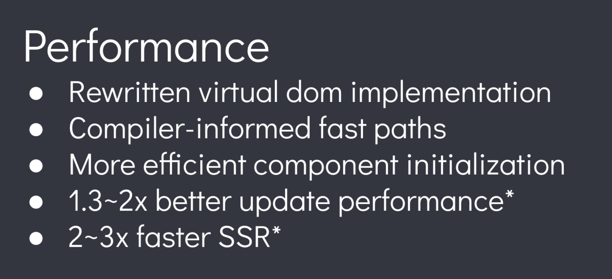
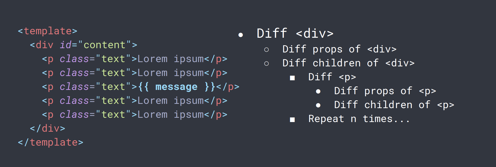
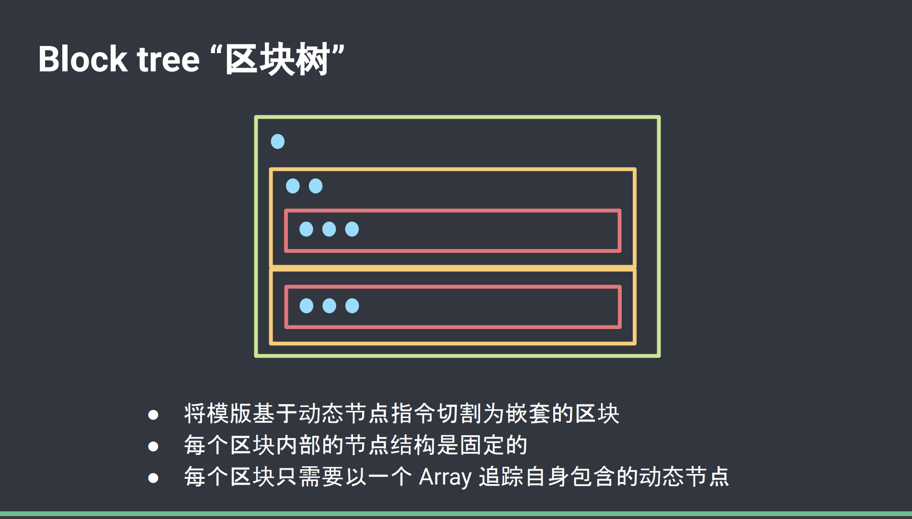
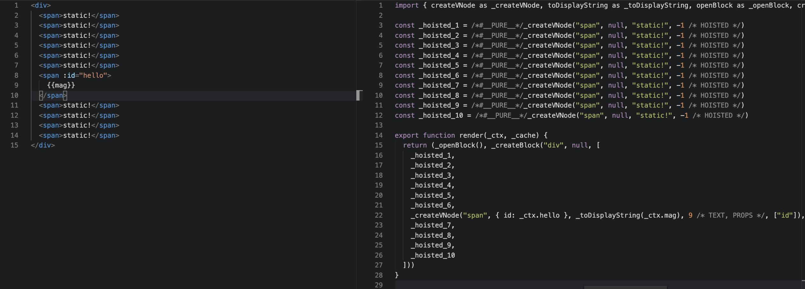
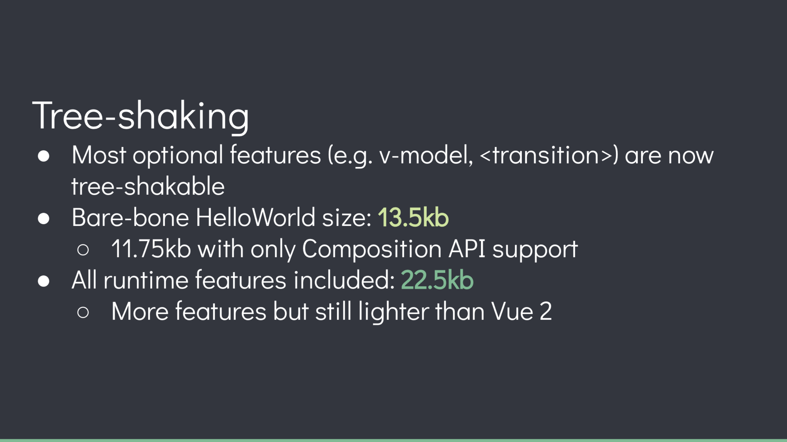
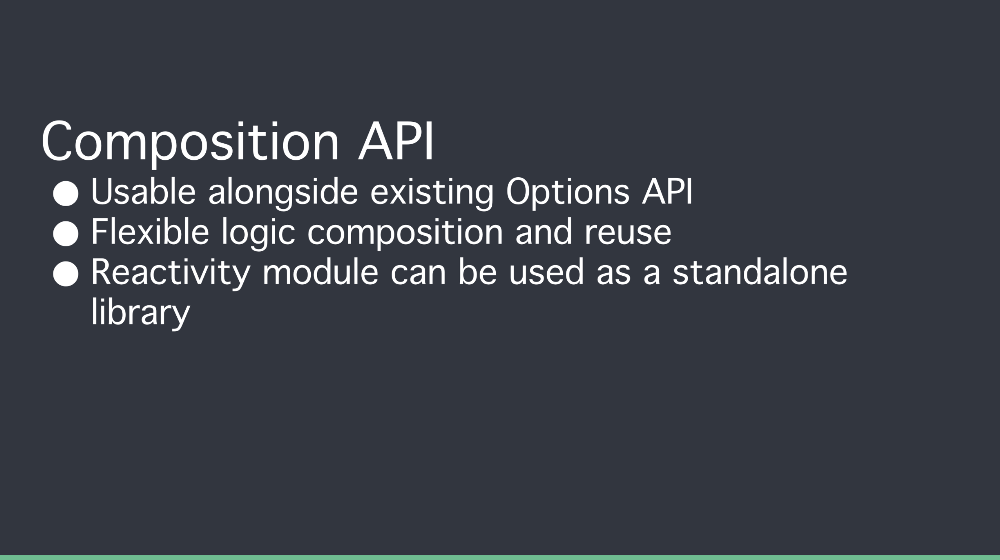
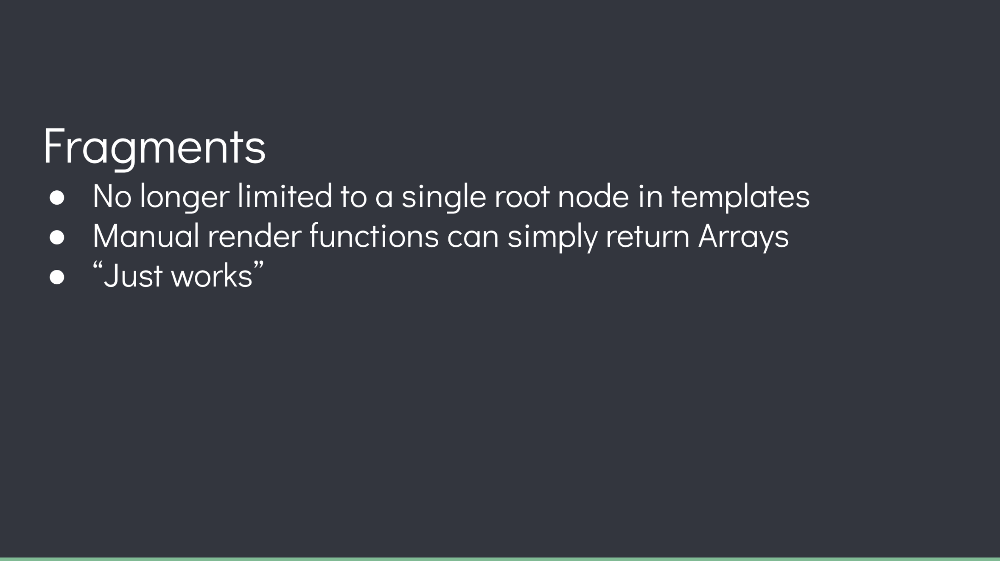

# Vue3.0变动简介

--------

对终端用户有明显感知的优化


* Performance：性能更比v2强
* Tree shaking support：可以将无用模块“剪辑”，仅打包需要的。
* Composition API：组合API
* Fragment, Teleport, Suspense：新增原生功能 “碎片”，Teleport即Protal传送门，“悬念”
* Better TypeScript support：更优秀的Ts支持
* Custom Renderer API：暴露了自定义渲染API

## Performance

---



* 重写了虚拟dom的实现，且保证了兼容性
* 编译模板的优化
  * 为什么： vdom 本质还是需要花时间渲染 diff
  * 怎么做：编译优化主要的方案
    * 基于模版直接生成命令式dom 【 angular】
    * vue2.x的diff方式为全部节点递归对比，vue 3 利用分析模版优化编译时的diff内容。
  * 保留vdom 原因
    * 考虑兼容性 v2 render函数 jsx
    * 提供了一个很好的模版之外更灵活复杂的编写dom的方式 尤其对于库作者
* 更高效的组件初始化
  * 对组件实例创建进行很大优化，对比纯js占用时间：
    * update性能提高1.3~2倍
    * mount性能提高1.3～1.5倍
    * SSR速度提高了2~3倍

## vdom

---

[vue-next-template-explorer.netlify.app](https://vue-next-template-explorer.netlify.app/)


Vue提供类似于HTML的模板语法，将模板编译为可返回虚拟DOM树的呈现函数。通过DIFF算法，递归遍历两个虚拟DOM树并比较每个节点上的每个属性来确定实际DOM的哪些部分需要更新。

### 传统 vdom 的性能瓶颈

传统 vdom 的性能跟模版大小正相关，跟动态节点的数量无关。在一些组件整个 模版内只有少量动态节点的情况下，这些遍历都是性能的浪费。



### 编译模版的优化


示例：

```html
<div>
  <span>static!</span>
  <span>{{ msg }}</span>
  <span id="id">{{ msg }}</span>
  <span :id="id">{{ msg }}</span>
</div>
```

* 划分不同的block及静态节点与动态绑定节点



* _createVNode方法后的内容叫做patchFlag，是在编译时生成的一个hint，在vnode更新patch阶段标志该节点是否追踪变化
* /* TEXT*/ 标志只需对msg的文字变动进行追踪
* 动态节点的绑定与嵌套层级无关，所有节点直接绑定在根及节点的block中
* 属性的绑定也相同：静态书写的属性只有在创建的时候会创建一次，后续不再进行追踪；动态绑定的属性patchFlag会发生对应的变化

### 优化运行时的内存占用 hoistStatic

把大量的静态节点提升，进行复用



静态节点会放在渲染函数之外，，也就是在应用启动的时候创建一次，这些静态的虚拟节点在每次创建的时候被不停复用，而不是像以前一样在每次更新的时候创建一堆新的vdom对象，销毁旧对象，节省内存空间

* 当静态节点数据非常大时，会将静态节点以innerHtml的形式直接插入

### 事件侦听器缓存cacheHandler

```html
<div>
  <span @click="onclick">static!</span>
</div>
```


在编译绑定函数时会进行静态分析，判断是否可以被cache起来。

如果可以被缓存，则会在第一次渲染时会创建这个内联函数并缓存，内联函数中引用最新的绑定函数，后续的更新直接在cache中取同一个函数，也就不需要再改变，将绑定函数变成静态

即使绑定的是内联函数也会被cache起来

事件缓存在组件中的优势在组件中更加明显

* 如果未添加该优化，每次优化都传递新的内联函数，父组件一旦更新，子组件也会跟着更新
* 类比react hooks，所有的函数在传到子组件的时候都是重新创建的，如果想要确保子组件不更新需要使用useMemo将其包裹起来，Vue实际上是在编译时将useMemo这步操作做好
  
  很明显，Vue的风格就是让一些细微的，但是可能会影响到整体性能的小优化，直接在编译时替用户做好。

## Tree-shaking

------



* 可以将无用模块“剪辑”，仅打包需要的（比如v-model,<transition>，用不到就不会打包）。
  * 我们在项目中都会使用一些构建工具如Webpack，Rollup，这些工具都是有treeshaking功能的， 前提是所有的东西都需要import来写，但是工具对于库本身无法进行tree-shaking。所以v3本身在对于代码打包的时候会做一些操作，只引入用到的模块。当然，一些必备的的模块如vdom的更新算法及响应式系统是一定会包含在包里的。
  * 示例
    ```html
      <div>
        <input v-model="model" ></input>
        <input v-model="model" type="text"></input>
        <input v-model="model" :type="text"></input>
        <input v-model="model" type="checkbox"></input>
      </div>
    ```
* 一个简单“HelloWorld”大小仅为：13.5kb
  
  * 11.75kb，仅Composition API。
  
    * V2中有一些无法被tree-shaking的Option API，后续可能会提供一个开关来强制删除这个Option API。
  
* 包含运行时完整功能：22.5kb
  * 拥有更多的功能，却比v2更迷你。

## Composition API 合成API

---



* 可与现有的 Options API一起使用
* 灵活的逻辑组合与复用
* v3的响应式模块可以和其他框架搭配使用

混入(mixin) 将不再作为推荐使用， Composition API可以实现更灵活且无副作用的复用代码。

可以将Composition API理解为新添加的API，并不影响原有API的使用

官方RFC文档：[composition-api.vuejs.org/api.html#se…](https://composition-api.vuejs.org/api.html#setup)

详见Composition API 简介

## Fragments 碎片

------



* 不再限于模板中的单个根节点
  * Vue2中，模版只能有一个根节点，但在Vue3中可以书写多个根节点，在render函数中会将根节点自动变为一个_Fragment 【示例】
* render函数也可以返回数组了，类似实现了 React.Fragments 的功能 。
* 'Just works'

## Teleport

----


Teleport原先是对标`React Portal（增加多个新功能，更强）

**但因为Chrome有个提案，会增加一个名为Portal的原生element，为避免命名冲突，改为Teleport**

主要做的事：**用一种直接声明的方式来将子组件安装到DOM中的其他位置**

一个简单示例：

```html
<body>
  <div id="app">
    <h1>Move the #content with the portal component</h1>
    <teleport to="#endofbody">
      <div id="content">
        <p>
          this will be moved to #endofbody.<br />
          Pretend that it's a modal
        </p>
        <Child />
      </div>
    </teleport>
  </div>
  <div id="endofbody"></div>
  <script>
    new Vue({
      el: "#app",
      components: {
        Child: { template: "<div>Placeholder</div>" }
      }
    });
  </script>
</body>
```

我们会得到如下的结果：

* `<teleport>`的所有子代-在此示例中：<div id=“ content”>和`<Child>`将附加到<div id =“ endofbody”>
* 作为这些子项之一的`<Child>`组件将仍然是`<teleport>`父级的子组件,也就是说`<teleport>`是透明的

```html
<div id="app">
  <!-- -->
</div>
<div id="endofbody">
  <div id="content">
    <p>
      this will be moved to #endofbody.<br />
      Pretend that it's a modal
    </p>
    <div>Placeholder</div>
  </div>
</div>
```

RFC文档：[github.com/vuejs/rfcs/…](https://github.com/vuejs/rfcs/blob/master/active-rfcs/0025-teleport.md)

使用文档：[portal-vue.linusb.org/](https://portal-vue.linusb.org/)

## suspense

------


Suspense翻译为：“悬念” 【实验性功能】

* 可在嵌套层级中等待嵌套的异步依赖项
  * 在一个嵌套的组件树渲染到屏幕上之前，先在内存里进行渲染。在渲染过程中记录所有存在异步依赖的组件，只有在所有的异步依赖都被resolve之后才会把整个树渲染到dom中去
* 支持`async setup()`
  * 如果在组件中使用了async setup()函数，这个组件就会被看作异步组件，suspense就会等待async setup()函数中所有的promise都resolve之后，再把整个树渲染出来。
* 支持异步组件

## 更好的TypeScript支持

------


* Vue 3是用typeScript编写的库，可以享受到自动的类型定义提示
* JavaScript 和TypeScript中的API是相同的。
  * 事实上，代码也基本相同
* 支持TSX
* class组件还会继续支持，但是需要引入vue-class-component@next，该模块目前还处在 alpha 阶段。

`Vue 3 + TypeScript`插件：

* 可以在单文件中对模版里的表达式进行类型检查，自动补全等功能。
* 本质是把模版编译成TS，进行一个操作，再把TS的操作反馈到模版中去


## Custom Render API 自定义渲染器API

------


* 正在进行NativeScript Vue集成 ，开放更多底层功能
* 用户可以尝试WebGL自定义渲染器，与普通Vue应用程序一起使用（Vugel）。

意味着以后可以通过 vue， Dom编程的方式来进行 webgl 编程。感兴趣可以看这里：[Getting started vugel](https://vugel.planning.nl/#application)

## 试用Vue3途径

----

* [Codepen](https://codepen.io/team/Vue/pen/KKpRVpx)
* 使用Vite通过以下方式启动项目：

```js
npm init vite-app hello-vue3
```

vite是一个新工具，法语“快”的意思。 地址：[github.com/vuejs/vite](https://github.com/vitejs/vite)

一个简易的`http`服务器，无需`webpack`编译打包，根据请求的`Vue`文件，直接发回渲染，且支持热更新（非常快）

## 其他部分

------

* 大多数官方框架部件也提供了v3支持。最新状态：[github.com/vuejs/vue-n…](https://github.com/vuejs/vue-next#status-of-the-rest-of-the-framework)
* V3文档已更新：[v3.vuejs.org](https://v3.vuejs.org/)（**注：新文档（尤其是《迁移指南》）仍在开发中，将在整个RC阶段继续完善。**）
* Devtools Beta已获批准，可在Chrome网上应用店中使用（**注：devtools需要vue@^3.0.0-rc.1**）


* v2还有2.7版本
  * 将有最后一个小版本（2.7）
  * 从`Vue 3`向后移植兼容的改进(不损坏兼容性前提下)
  * 加上在`Vue 3`中删除的功能的弃用警告
  * `LTS`18个月。

最后建议：`Vue 3`虽好，如果你的项目很稳定，且对新功能无过多的要求或者迁移成本过高，则不建议升级。

## 实验性功能

----

* `<Suspense>`
* `<script setup>`
* `<style vars>`

这些功能现已发布，目的是收集实际使用情况的反馈，但它们可能仍会收到重大更改/重大调整。它们可能会在3.0中保持试验状态，并最终成为3.1的一部分。

## CompositionAPI

----

v3最大的改变是加入了这个灵感来源于React Hook的Composition API，这个API将对vue编程产生了根本性变革，但是v3还是兼容v2的Options API。除此之外，还引入了一些不兼容修改，具体可查看[Vue3已合并的RFC](https://github.com/vuejs/rfcs/pulls?q=is%3Apr+is%3Amerged+label%3A3.x)。

先看一个示例：

```html
<template>
  <button @click="increment">
    Count is: {{ state.count }}, double is: {{ state.double }}
  </button>
</template>

<script>
import { reactive, computed } from 'vue'

export default {
  setup(props, context) {
    const state = reactive({
      count: 0,
      double: computed(() => state.count * 2)
    })
    
    function increment() {
      state.count++
    }
    
    return {
      state,
      increment
    }
  }
}
</script>
```

可以看到v3的组件大体还是和v2一致，由template、script和style组成，作出的改变有以下几点：

* 组件增加了setup选项，组件内所有的逻辑都在这个方法内组织，返回的变量或方法都可以在模板中使用。
* v2中data、computed等选项仍然支持，但使用setup时不建议再使用v2中的data等选项。
* 提供了reactive、computed、watch、onMounted等抽离的接口代替v2中data等选项。

**Options API 与 Composition API**

> 随着Vue的采用率增长，许多用户也正在使用Vue来构建大型项目，这些项目是由多个开发人员组成的团队在很长的时间内反复进行和维护的。</br></br>
> 我们目睹了其中一些项目遇到了Vue当前API所带来的编程模型的限制。这些问题可以概括为两类：


> 1. 随着功能的增长，复杂组件的代码变得越来越难以推理。这种情况尤其发生在开发人员正在阅读自己未编写的代码时。根本原因是Vue的现有API通过选项强制执行代码组织，但是在某些情况下，通过逻辑考虑来组织代码更有意义。
> 2. 缺乏用于在多个组件之间提取和重用逻辑的干净且免费的机制。（有关“[逻辑提取和重用](https://v3.vuejs.org/guide/composition-api-introduction.html#logic-extraction-and-reuse)”的更多详细信息）
> 
> 该RFC中提议的API在组织组件代码时为用户提供了更大的灵活性。现在可以将代码组织为各自处理特定功能的函数，而不必总是通过选项来组织代码。API还使在组件之间甚至外部组件之间提取和重用逻辑变得更加简单。

在RFC的开发动机中也可以看出Composition API是为了解决v2在应对大型复杂项目时Option API的各种缺陷与不足

**代码组织**

Options API是把代码分类写在几个Option中：

```js
export default {
  components: {
    
  },
  data() {
    
  },
  computed: {
    
  },
  watch: {
    
  },
  mounted() {
    
  },
}
```

当组件比较简单只有少数逻辑的时候，在各个Option之间来回穿梭还不算麻烦，但当一个vue组件内存在多个逻辑时会怎样呢？


* 使用Options API时，相同的逻辑写在不同的地方，各个逻辑的代码交叉错乱，这对维护别人代码的开发者来说绝不是一件简单的事，理清楚这些代码都需要花费不少时间。
* 而使用Composition API时，相同的逻辑可以写在同一个地方，这些逻辑甚至可以使用函数抽离出来，各个逻辑之间界限分明，即便维护别人的代码也不会在“读代码”上花费太多时间。

**逻辑抽取与复用**

v2中我们通常使用mixin来实现逻辑复用，但他的问题也非常明显：

* 命名冲突。mixin的所有option如果与组件或其它mixin相同会被覆盖

* 没有运行时实例。顾名思义，mixin不过是把对应的option混入组件内，运行时不存在所抽取的逻辑实例。

* 松散的关系。Options API注定所抽取的逻辑的组织是松散，逻辑内部之间的关系也是松散的。

* 含蓄的属性增加。mixin加入的option是含蓄的，尤其是在有多个mixin的时候，无法知道当前属性是哪个mixin的。

在vue3中提供了一种叫Composition Function的方式，这种方式允许像函数般抽离逻辑：

```html
<template>
  <div>
   <p> {{count}}</p>
    <button @click="onClick" :disabled="state">Start</button>  
  </div>
</template>

<script>
  import {ref} from 'vue'
  // 倒计时逻辑的Composition Function
  const useCountdown = (initialCount) => {
    const count = ref(initialCount)
    const state = ref(false)
    const start = (initCount) => {
      state.value = true;
      if (initCount > 0) {
        count.value = initCount
      } 
      if (!count.value) {
        count.value = initialCount
      }
      const interval = setInterval(() => {
        if (count.value === 0) {
          clearInterval(interval)
          state.value = false
        } else {
          count.value--
        }
      }, 1000)
    }
    return {
      count,
      start,
      state
    }
  }
  
  export default {
   setup() {
    // 直接使用倒计时逻辑
     const {count, start, state} = useCountdown(10)
     const onClick = () => {
        start()
     }
     return  {count, onClick, state}
   }
  }
</script>
```

v3建议使用如React hook中一样使用use开头命名抽取的逻辑函数，如上代码抽取的逻辑几乎如函数一般，使用的时候也极其方便。

**TS类型支持**

> 开发人员在大型项目上的另一个常见功能要求是更好的TypeScript支持。Vue当前的API在与TypeScript集成时提出了一些挑战，这主要是由于Vue依赖单个`this`上下文来公开属性，并且`this`在Vue组件中的使用比普通JavaScript更具魔力（例如`this`嵌套在`methods`指向组件实例而非`methods`对象的点下方的内部函数）。换句话说，Vue的现有API只是在设计时就没有考虑类型推断，并且在尝试使其与TypeScript完美配合时会产生很多复杂性。

v2对ts的支持主要是通过vue-class-component，还需引入依赖包，且缺点也十分明显：要使Class API解决类型问题，它必须依赖装饰器-这是一个非常不稳定的第2阶段提案，在实现细节方面存在很多不确定性。

相比与v2，v3对ts的支持则好得多：

* v3中是在setup中进行编程，setup不依赖this,大部分API大多使用普通的变量和函数，这些变量和函数自然是类型友好的。
* 用Composition API编写的代码可以享受完整的类型推断，几乎不需要手动类型提示。这也意味着用提议的API编写的代码在TypeScript和普通JavaScript中看起来几乎相同。
* 这些接口已获得更好的IDE支持，即使非TypeScript用户也可以从中受益。

## Composition API 介绍

-------

**setup**

setup是vue新增的一个选项，它是组件内使用Composition API的入口。setup中不使用this上下文。

* **调用时间**
  
  setup是在创建vue组件实例并完成props的初始化之后执行，也是在beforeCreate钩子之前执行,这意味着setup中无法使用其它option（如data）中的变量，而其它option可以使用setup中返回的变量。

* 模板使用
  
  如果setup返回一个对象，这个对象的所有属性会合并到template的渲染上下文中，也就是说可以在template中使用setup返回的对象的属性。

  ```html
  <template>
    <div>{{ count }} {{ object.foo }}</div>
  </template>
  
  <script>
    import { ref, reactive } from 'vue'
  
    export default {
      setup() {
        const count = ref(0)
        const object = reactive({ foo: 'bar' })
  
        // expose to template
        return {
          count,
          object
        }
      }
    }
  </script>
  ```

* **与Render Function/jsx结合使用**
  
  setup也可以返回render function，使用方法与vue2中的render方法类似。

  ```js
  import { h, ref, reactive } from 'vue'
  
  export default {
    setup() {
      const count = ref(0)
      const object = reactive({ foo: 'bar' })
  
      return () => h('div', [count.value, object.foo])
    }
  }
  ```

* **setup的参数**
  setup有两个参数，第一个参数为props，是组件的所有参数，与vue2中一样，参数是响应式的，改变会触发更新；第二个参数是setup context，包含emit等属性。

  ```js
  const MyComponent = {
    setup(props, context) {
      context.attrs
      context.slots
      context.emit
    }
  }
  ```

* **this的使用**

  > `this` **is not available inside** `setup()`. Since `setup()` is called before 2.x options are resolved, `this` inside `setup()` (if made available) will behave quite differently from `this` in other 2.x options. Making it available will likely cause confusions when using `setup()` along other 2.x options. Another reason for avoiding `this` in `setup()` is a very common pitfall for beginners

  v3中同时支持Options API 与Composition API，由于setup()会在Option API 解析之前调用，而此时setup()内部的this指向与Option API中的完全不同，非常可能引起混乱。

  故而，setup中不使用this上下文。

**reactive**

`reactive`函数接收一个对象，并返回一个对这个对象的响应式代理。它与v2中的Vue.obserable()是等价的

```js
const obj = reactive({ count: 0 })
```

**ref**

ref函数接收一个用于初始化的值并返回一个响应式的和可修改的ref对象。该ref对象存在一个value属性，value保存着ref对象的值。

```js
const count = ref(0)
console.log(count.value) // 0

count.value++
console.log(count.value) // 1
```

**isRef**

`isRef`用于判断变量是否为ref对象。

```js
const unwrapped = isRef(foo) ? foo.value : foo
```

**toRefs**

toRefs用于将一个reactive对象转化为属性全部为ref对象的普通对象。

```js
const state = reactive({
  foo: 1,
  bar: 2
})
const stateAsRefs = toRefs(state)
/*
Type of stateAsRefs:
{
  foo: Ref<number>,
  bar: Ref<number>
}
*/
```

toRefs在setup或者Composition Function的返回值时可以保证在使用解构语法之后对象依旧为相应式

```js
import {reactive, toRefs} from 'vue'
function useFeatureX() {
  const state = reactive({
    foo: 1,
    bar: 2
  })
  return state
}
function useFeature2() {
  const state = reactive({
    a: 1,
    b: 2
  })
  return toRefs(state)
}

export default {
  setup() {
    // 使用解构之后foo和bar都丧失响应式
    const { foo, bar } = useFeatureX()
    // 即便使用了解构也不会丧失响应式
    const {a, b}= useFeature2()
    return {
      foo,
      bar
    }
  }
}
```

**computed**

computed函数与vue2中computed功能一致，它接收一个函数并返回一个value为getter返回值的不可改变的响应式ref对象。

```js
const count = ref(1)
const plusOne = computed(() => count.value + 1)

console.log(plusOne.value) // 2
plusOne.value++ // error,computed不可改变


// 同样支持set和get属性
onst count = ref(1)
const plusOne = computed({
  get: () => count.value + 1,
  set: val => { count.value = val - 1 }
})
plusOne.value = 1
console.log(count.value) // 0
```

**readonly**

readonly函数接收一个对象（普通对象或者reactive对象）或者ref，并返回一个**只读的**原始参数对象代理，在参数对象改变时，返回的代理对象也会相应改变。如果传入的是reactive或ref响应对象，那么返回的对象也是响应的。

简而言之就是给传入的对象新建一个只读的副本。

```js
const original = reactive({ count: 0 })

const copy = readonly(original)

watchEffect(() => {
  // 原始对象的变化会出发副本的watch
  console.log(copy.count)
})

// 原始对象改变，副本的值也会改变
original.count++

// 副本不可更改
copy.count++ // warning!
```

**watchEffect**

在追踪其依赖时立即运行一个函数，并在依赖发生变化时重新运行

```js
const count = ref(0)

watchEffect(() => console.log(count.value))
// -> logs 0

setTimeout(() => {
  count.value++
  // -> logs 1
}, 100)
```

* **取消观察**
  
  接口会返回一个函数，该函数用以取消观察。

  ```js
  const stop = watchEffect(() => {
    /* ... */
  })
  // later
  stop() // 取消之后对应的watchEffect不会再执行
  ```

* **清除副作用**（side effect）
  
  为什么需要清除副作用？有这样一种场景，在watch中执行异步操作时，在异步操作还没有执行完成，此时第二次watch被触发，这个时候需要清除掉上一次异步操作。

  ```js
  watch(onInvalidate => {
    const token = performAsyncOperation(id.value)
    onInvalidate(() => {
      // id has changed or watcher is stopped.
      // invalidate previously pending async operation
      token.cancel()
    })
  })
  ```

  watch提供了一个onInvalidate的副作用清除函数，该函数接收一个函数，在该函数中进行副作用清除。在以下情况中调用：

  * watch的callback即将被第二次执行时。
  * watch被停止时，即组件被卸载之后

**接口还支持配置一些选项以改变默认行为，配置选项可通过watch的最后一个参数传入。**

* `flush` 当同一个tick中发生许多状态突变时，Vue会缓冲观察者回调并异步刷新它们，以避免不必要的重复调用。
  
  默认的行为是：当调用观察者回调时，组件状态和DOM状态已经同步。

  这种行为可以通过flush来进行配置，flush有三个值，分别是`post`(默认)、`pre`与`sync`。`sync`表示在状态更新时同步调用，`pre`则表示在组件更新之前调用。

  ```js
  watchEffect(
    () => {
      /* ... */
    },
    {
      flush: 'sync'
    }
  )
  ```

* **onTrack与onTrigger用于调试**:
  
  * onTrack：在reactive属性或ref被追踪为依赖时调用。
  * onTrigger： 在watcher的回调因依赖改变而触发时调用。

  ```js
  watchEffect(
    () => {
    /* side effect */
    },
    {
      onTrigger(e) {
        debugger
      }
    }
  )
  ```

  onTrack与onTrigger仅适用于开发模式。

**watch**

相比于v2的watch，Composition API的watch接口不仅仅是将其逻辑抽取出来，更增加了一些功能。

* **基本用法**

```js
const state = reactive({count: 0})
const inputRef = ref('')
// state.count与inputRef中任意一个源改变都会触发watch
watch(() => {
  console.log('state', state.count)
  console.log('ref', inputRef.value)
})
```

* **指定依赖源**

```js
 const state2 = reactive({count: ''})
 const ref2 = ref('')
 // 通过函数参数指定reative依赖源
 // 只有在state2.count改变时才会触发watch
 watch(
   () => state2.count,
   () => {
     console.log('state2.count',state2.count)
     console.log('ref2.value',ref2.value)
   })
// 直接指定ref依赖源
watch(ref2,() => {
  console.log('state2.count',state2.count)
  console.log('ref2.value',ref2.value)
})
```

* **watch多个数据源**

```js
const state = reactive({a: 'a', b: 'b'})

watch(
  // state.a和state.b任意一个改变都会触发watch的回调
  () => [state.a, state.b],
  // 回调的第二个参数是对应上一个状态的值
  ([a, b], [preA, preB]) => {
    console.log('callback params:', a, b, preA, preB)
    console.log('state.a', state.a)
    console.log('state.b', state.b)

const ref1 = ref(1)
const ref2 = ref(2)
watch([ref1, ref2],([val1, val2], [preVal1, preVal2]) => {
  console.log('callback params:', val1, val2, preVal1, preVal2)
  console.log('ref1.value:',ref1.value)
  console.log('ref2.value:',ref2.value)
})
```

* watchEffect的功能及使用方法 watch同样适用 【取消观察/清除副作用/flush/调试】

**Lifecycle Hooks**

Composition API当然也提供了组件生命周期钩子的回调。

```js
import { onMounted, onUpdated, onUnmounted } from 'vue'

const MyComponent = {
  setup() {
    onMounted(() => {
      console.log('mounted!')
    })
    onUpdated(() => {
      console.log('updated!')
    })
    onUnmounted(() => {
      console.log('unmounted!')
    })
  }
}
```

对比vue2的生命周期钩子

* `beforeCreate` -> 使用 `setup()`
* `created` -> 使用 `setup()`
* `beforeMount` -> `onBeforeMount`
* `mounted` -> `onMounted`
* `beforeUpdate` -> `onBeforeUpdate`
* `updated` -> `onUpdated`
* `beforeDestroy` -> `onBeforeUnmount`
* `destroyed` -> `onUnmounted`
* `errorCaptured` -> `onErrorCaptured`

更多内容详见 [Composition API 文档](https://v3.vuejs.org/guide/composition-api-introduction.html#setup)

链接汇总：

[vue3文档](https://v3.vuejs.org/)

[RFCs文档](https://github.com/vuejs/rfcs)

[v3编译代码演示网址](https://vue-next-template-explorer.netlify.app/)

[Teleport RFC](https://github.com/vuejs/rfcs/blob/master/active-rfcs/0025-teleport.md)

[Teleport 文档](https://portal-vue.linusb.org/)

[Getting started vugel](https://vugel.planning.nl/#application)

[Codepen](https://codepen.io/team/Vue/pen/KKpRVpx)

[github.com/vuejs/vite](https://github.com/vuejs/vite)

[官方框架v3支持最新状态](https://github.com/vuejs/vue-next#status-of-the-rest-of-the-framework)

参考资料：

[Composition API 文档](https://composition-api.vuejs.org/api.html#setup)

[尤雨溪B站直播：聊聊 Vue.js 3.0 Beta](https://www.bilibili.com/video/BV1ke411W7WB)

[抄笔记：尤雨溪在Vue3.0 Beta直播里聊到了这些…](https://juejin.im/post/5e9f6b3251882573a855cd52#heading-14)

[Vue3 Composition API 使用教程](https://juejin.im/post/5e4415196fb9a07ca530331c)

[infoQ：Vue3 新API介绍](https://www.infoq.cn/article/VzxPwxX2GpERAJymrN3U)

[英文原文](https://vueschool.io/articles/vuejs-tutorials/exciting-new-features-in-vue-3/)

[Vue3 设计过程 尤小右](https://increment.com/frontend/making-vue-3/)

[7/18 v3 RC版本](https://github.com/vuejs/rfcs/issues/189)

[2019/6/8 VueConf state of vue PPT](https://img.w3ctech.com/VueConf2019SH_Evan.pdf)